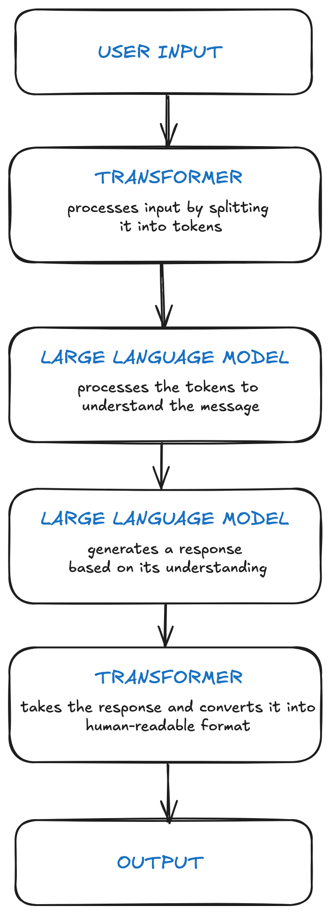

# Chatbot Application

This is a simple chatbot application built using the Hugging Face Transformers library. The chatbot leverages the `facebook/blenderbot-400M-distill` model to generate conversational responses.

## Features
- Interactive chatbot that maintains conversation history.
- Uses a pre-trained sequence-to-sequence model for generating responses.
- Easy to extend and customize with other Hugging Face models.

## How It Works
The chatbot processes user input, tokenizes it, and generates a response using the BlenderBot model. The conversation flow is as follows:



1. **User Input**: The user provides input to the chatbot.
2. **Transformer**: The input is tokenized into numerical representations.
3. **Large Language Model**: The model processes the tokens and generates a response.
4. **Transformer**: The response is converted back into human-readable text.
5. **Output**: The chatbot displays the response to the user.

## Installation

1. Clone the repository:
   ```bash
   git clone https://github.com/ngnamquoc/chatbot-app.git
   cd chatbot-app
   ```

2. Create and activate a virtual environment:
   ```bash
   python3 -m venv my_env
   source my_env/bin/activate
   ```

3. Install dependencies:
   ```bash
   pip install -r transformers torch
   ```

## Usage

Run the chatbot application:
```bash
python3 chatbot.py
```

Start interacting with the chatbot by typing your messages. The chatbot will respond based on the conversation history.

## Customization

To use a different model, update the `model_name` variable in `chatbot.py` with the desired Hugging Face model. Ensure the model is compatible with `AutoModelForSeq2SeqLM`.

Example:
```python
model_name = "google/flan-t5-base"
```

## Requirements
- Python 3.10 or higher
- Hugging Face Transformers
- PyTorch

## License
This project is licensed under the MIT License.